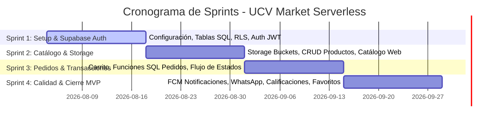

# UCV Market - Master Blueprint
## Documento 01: Análisis de Requerimientos y Planificación Scrum (Versión Supabase Serverless)

Este documento de ingeniería de software detalla la fase de análisis del problema, justificación tecnológica, objetivos, alcance, requerimientos y planificación para el proyecto **UCV Market**, una plataforma móvil/web híbrida optimizada para el comercio estudiantil en la Universidad César Vallejo (UCV), rediseñada bajo una arquitectura serverless basada en **Supabase**.

---

### 1. Análisis del Problema

El comercio estudiantil es una actividad vital dentro de los campus de la Universidad César Vallejo (UCV). Sin embargo, la canalización del mismo a través de grupos de WhatsApp (como "Emprendedores UCV") genera ineficiencias críticas que limitan el crecimiento de los emprendimientos y perjudican la experiencia de los compradores:

1. **Eficiencia en la Comunicación (Efecto "Mensaje Perdido"):**
   - *Problema:* Las ofertas de productos se publican como mensajes de texto continuos o imágenes sueltas que se pierden rápidamente en el historial de conversación a medida que otros usuarios escriben.
   - *Impacto:* Un comprador potencial que ingresa al chat horas después de una publicación difícilmente la encontrará. La vida útil de una oferta es inferior a los 30 minutos.
   
2. **Ausencia de un Catálogo Estructurado:**
   - *Problema:* No existe categorización (comida, postres, servicios académicos, ropa, etc.).
   - *Impacto:* Los compradores deben revisar todo el historial para descubrir qué se vende, en lugar de navegar por categorías de interés.

3. **Inexistencia de un Buscador y Filtros:**
   - *Problema:* WhatsApp no permite filtrar por rango de precios, disponibilidad inmediata o tipo de entrega.
   - *Impacto:* Fricción en la conversión de ventas. El proceso de búsqueda es puramente manual y aleatorio.

4. **Falta de Control de Stock y Disponibilidad:**
   - *Problema:* El vendedor no puede marcar un producto como "Agotado" de manera persistente. Los compradores siguen escribiendo por productos que ya no están disponibles.
   - *Impacto:* Desperdicio de tiempo para ambas partes y frustración del cliente.

5. **Asimetría de Información y Falta de Reputación:**
   - *Problema:* No existe un registro histórico de la fiabilidad del vendedor ni de la calidad de sus productos. Cualquier usuario con acceso al enlace del grupo puede ingresar y vender sin validación.
   - *Impacto:* Riesgo de productos en mal estado, impuntualidad en las entregas y falta de seguridad física al concretar transacciones en el campus.

6. **Complejidad Logística (Puntos de Entrega):**
   - *Problema:* Los campus universitarios son grandes (múltiples pabellones, pisos, áreas comunes). Coordinar el punto de entrega de forma verbal ("nos vemos en el pabellón B") suele ser impreciso.
   - *Impacto:* Retrasos y pérdida de tiempo entre clases tanto para el vendedor como para el comprador.

---

### 2. Justificación del Proyecto

#### Desde la Perspectiva Social y Económica (Impacto Estudiantil):
El proyecto apoya directamente la retención estudiantil. Muchos alumnos dependen de sus emprendimientos diarios para pagar sus pensiones académicas. Al dotarles de una herramienta que optimice sus ventas, reducimos la tasa de deserción por motivos económicos.

#### Justificación del Nuevo Stack Tecnológico (Enfoque Serverless con Supabase):
Tradicionalmente, un sistema de esta naturaleza requeriría un backend dedicado (como Laravel) hospedado en servidores propios (VPS, AWS), base de datos independiente y almacenamiento S3. Esto incrementa el costo de mantenimiento, la complejidad en la administración del servidor y el tiempo de comercialización (Time-to-Market).

El rediseño del proyecto hacia **Supabase** se justifica por las siguientes razones de arquitectura e ingeniería:

1. **Reducción de Tiempo de Desarrollo (Time-to-Market):** Supabase provee de inmediato APIs REST y GraphQL auto-generadas a partir de la estructura de la base de datos PostgreSQL, eliminando la necesidad de escribir controladores, requests y enrutadores en un backend personalizado.
2. **Seguridad Integrada mediante Row Level Security (RLS):** En lugar de desarrollar middlewares y lógica compleja de autenticación/autorización en Laravel, PostgreSQL permite declarar políticas RLS directamente en las tablas. Esto asegura a nivel de base de datos que un usuario solo pueda modificar sus propios productos o ver sus propios pedidos, previniendo accesos indebidos incluso si el frontend es vulnerado.
3. **Supabase Auth (Autenticación Out-of-the-box):** Gestión completa de usuarios, login, registro, recuperación de contraseñas y emisión de tokens JWT de manera nativa y segura, reduciendo el riesgo de fallas de seguridad en el flujo de credenciales.
4. **Supabase Storage:** Gestión integrada para subir y descargar archivos (imágenes de productos) con seguridad basada en RLS. Evita la complejidad de integrar librerías externas de AWS S3 o Cloudinary.
5. **PostgreSQL como Motor de Base de Datos:** PostgreSQL es un motor de base de datos relacional robusto, de código abierto y altamente extensible, superior a MySQL en el manejo de tipos de datos complejos, transacciones ACID estrictas e integridad de datos.
6. **Ionic + Angular + Capacitor:** Mantiene una base de código única para compilar como Aplicación Web responsiva, Aplicación Android y PWA (Progressive Web App). Angular proporciona el tipado estricto de TypeScript y estructura modular, ideal para aplicaciones escalables, mientras RxJS gestiona de forma reactiva el flujo de datos proveniente de Supabase.

---

### 3. Objetivos del Proyecto

#### Objetivo General:
Desarrollar e implementar la primera versión (MVP) de la plataforma digital híbrida **UCV Market** utilizando la arquitectura serverless de Supabase e Ionic/Angular, que optimice el comercio interno en la comunidad universitaria de la UCV, garantizando transacciones estructuradas, seguras y eficientes.

#### Objetivos Específicos:
1. Diseñar e implementar el esquema físico de base de datos relacional en PostgreSQL (Supabase) con políticas RLS de seguridad activadas.
2. Configurar el flujo de autenticación y autorización en Supabase Auth, restringiendo el registro inicial mediante dominios de correo universitario válidos.
3. Implementar un frontend móvil y web responsivo con Ionic/Angular basado en arquitectura limpia y patrón Repository para desacoplar el SDK de Supabase de la lógica del componente.
4. Crear un módulo de inventario que permita a los emprendedores gestionar su stock y subir imágenes de forma segura al Supabase Storage.
5. Desarrollar el flujo transaccional del carrito de compras y la gestión de pedidos utilizando PostgreSQL Functions en Supabase para asegurar operaciones atómicas.
6. Integrar notificaciones push mediante Firebase Cloud Messaging (FCM) a través de Supabase Edge Functions para alertar en tiempo real sobre cambios de estado en los pedidos.
7. Implementar un generador de enlaces dinámicos para WhatsApp que facilite el contacto final entre el comprador y el emprendedor.

---

### 4. Alcance del Proyecto (MVP vs. Mejoras Futuras)

#### Dentro del Alcance (Funcionalidades del MVP):
- **Autenticación:** Registro, Inicio de Sesión y Recuperación de Contraseñas (Supabase Auth).
- **Roles de Usuario:** Comprador, Emprendedor y Administrador.
- **Perfil de Usuario:** Datos de contacto (WhatsApp) y gestión de emprendimiento.
- **Gestión de Inventario:** CRUD de Productos con carga de imágenes a Supabase Storage y control de stock en tiempo real.
- **Catálogo de Productos:** Listado responsivo con buscador por nombre y filtro por categoría.
- **Carrito de Compras:** Gestión local del carrito para pedidos consolidados.
- **Gestión de Pedidos:** Flujo transaccional de pedidos (Pendiente, Aceptado, Listo, Entregado, Cancelado).
- **Calificaciones y Favoritos:** Sistema de estrellas (1-5) con reseñas para emprendedores y lista de productos favoritos por usuario.
- **Integración con WhatsApp:** Generación de enlaces dinámicos para contactar al vendedor.
- **Notificaciones Push:** Alertas móviles con Firebase Cloud Messaging coordinadas desde Supabase.
- **Panel Administrativo:** Moderación básica de categorías y productos.

#### Fuera del Alcance en el MVP (Planificado como Mejoras Futuras):
- Geolocalización en mapas interactivos, GPS y búsqueda por radio de cercanía física.
- Motor de recomendación de productos basado en Inteligencia Artificial y Machine Learning.
- Chat interno en tiempo real (se utiliza WhatsApp como canal de chat).
- Integración de analítica predictiva o modelos de lenguaje (OpenAI).

---

### 5. Casos de Uso del Sistema (MVP)

#### Actores del Sistema:
1. **Comprador:** Estudiante o docente que busca adquirir productos o servicios en el campus.
2. **Emprendedor:** Estudiante o colaborador que publica productos y gestiona las entregas.
3. **Administrador:** Encargado de velar por la seguridad y la moderación del contenido.

```mermaid
usecaseDiagram
    actor Comprador as "Comprador (Estudiante)"
    actor Emprendedor as "Emprendedor (Estudiante)"
    actor Administrador as "Administrador UCV"

    package UCV_Market_Supabase {
        usecase UC1 as "Registrarse e Iniciar Sesión"
        usecase UC2 as "Buscar y Filtrar Productos"
        usecase UC3 as "Gestionar Carrito y Favoritos"
        usecase UC4 as "Registrar Pedido (Punto Campus)"
        usecase UC5 as "Publicar Producto (Inventario)"
        usecase UC6 as "Aceptar/Rechazar Pedido (Stock)"
        usecase UC7 as "Calificar Vendedor"
        usecase UC8 as "Moderar Categorías y Publicaciones"
        usecase UC9 as "Contactar vía WhatsApp"
    }

    Comprador --> UC1
    Comprador --> UC2
    Comprador --> UC3
    Comprador --> UC4
    Comprador --> UC7
    Comprador --> UC9

    Emprendedor --> UC1
    Emprendedor --> UC5
    Emprendedor --> UC6
    Emprendedor --> UC9

    Administrador --> UC1
    Administrador --> UC8
```

---

### 6. Requerimientos Funcionales

#### Módulo de Autenticación y Perfil (RF-AUTH)
- **RF-AUTH-01:** El sistema debe permitir el registro de usuarios solicitando Nombre, Correo Institucional, Contraseña y Teléfono (WhatsApp).
- **RF-AUTH-02:** El sistema debe validar que el correo ingresado pertenezca a dominios institucionales válidos de la UCV.
- **RF-AUTH-03:** El sistema debe autenticar a los usuarios mediante Supabase Auth y generar tokens JWT de acceso válidos.
- **RF-AUTH-04:** El sistema debe permitir a los usuarios recuperar su contraseña mediante el envío de un enlace de restablecimiento al correo institucional.
- **RF-AUTH-05:** El usuario debe poder actualizar sus datos de perfil, incluyendo su número de teléfono celular (WhatsApp) e insignias de vendedor.

#### Módulo de Catálogo e Inventario (RF-PROD)
- **RF-PROD-01:** El emprendedor debe poder crear, editar y dar de baja productos, especificando Nombre, Descripción, Precio, Stock Disponible, Categoría e Imágenes.
- **RF-PROD-02:** Las imágenes de los productos deben subirse y almacenarse de forma segura en un bucket público de Supabase Storage.
- **RF-PROD-03:** El sistema debe descontar automáticamente el stock del producto al concretarse una orden o reservarse mediante un pedido aceptado.
- **RF-PROD-04:** El comprador debe poder realizar búsquedas de productos por nombre (búsqueda de texto parcial) y filtrar por categorías configuradas.
- **RF-PROD-05:** El comprador debe poder marcar productos como "Favoritos", guardando dicha relación en su perfil para acceso rápido.

#### Módulo de Pedidos y Carrito (RF-ORD)
- **RF-ORD-01:** El comprador debe poder añadir productos del catálogo a un carrito de compras local.
- **RF-ORD-02:** Al confirmar la compra, el sistema debe agrupar los productos por vendedor y registrar pedidos individuales.
- **RF-ORD-03:** El comprador debe seleccionar un punto de encuentro específico de una lista estática de lugares predefinidos del campus (e.g., Biblioteca Pabellón A, Cafetería Principal).
- **RF-ORD-04:** El emprendedor debe poder actualizar el estado del pedido: Pendiente, Aceptado, Listo para Entrega, Completado, o Cancelado.
- **RF-ORD-05:** Al completarse un pedido, el comprador debe poder calificar al vendedor (1 a 5 estrellas) e ingresar una reseña escrita.

#### Módulo de Notificaciones e Integración (RF-INTEG)
- **RF-INTEG-01:** El sistema debe redirigir al comprador al chat de WhatsApp del emprendedor con un mensaje pre-formateado que contenga los detalles del pedido y punto de encuentro.
- **RF-INTEG-02:** El sistema debe enviar notificaciones push automáticas a los dispositivos móviles registrados (FCM) cuando ocurran cambios de estado en sus pedidos (coordinado desde Supabase Edge Functions).

---

### 7. Requerimientos No Funcionales

#### Rendimiento y Concurrencia (RNF-PERF)
- **RNF-PERF-01 (Latencia de API):** Las APIs automáticas de Supabase deben retornar los datos de consulta en menos de 150 ms en condiciones normales de red.
- **RNF-PERF-02 (Concurrencia):** El backend serverless soportado por Supabase (PostgreSQL en infraestructura en la nube) debe admitir al menos 500 conexiones de base de datos simultáneas sin degradación del servicio.
- **RNF-PERF-03 (Peso de Medios):** La carga de imágenes debe ser validada en el frontend para no superar los 2MB por archivo, convirtiéndose localmente a WebP antes de subirse a Supabase Storage.

#### Seguridad e Integridad (RNF-SEC)
- **RNF-SEC-01 (Políticas RLS):** Todas las tablas de la base de datos PostgreSQL deben tener activado el Row Level Security (RLS) para evitar lecturas/escrituras cruzadas entre usuarios.
- **RNF-SEC-02 (Cifrado de Comunicaciones):** Toda petición hacia Supabase debe encriptarse en tránsito mediante HTTPS y TLS 1.3.
- **RNF-SEC-03 (Acceso a Storage):** Los buckets de imágenes de productos deben ser de lectura pública pero solo los creadores del producto deben poseer permisos de escritura/borrado mediante políticas RLS.

#### Disponibilidad y Portabilidad (RNF-PORT)
- **RNF-PORT-01 (Disponibilidad):** La plataforma backend dependiente de la infraestructura cloud de Supabase debe mantener una disponibilidad del 99.9%.
- **RNF-PORT-02 (PWA y Android):** El código frontend compilado con Ionic/Capacitor debe empaquetarse de manera responsiva y funcionar idénticamente como Web, PWA y aplicación nativa Android (APK).

---

### 8. Historias de Usuario (Formatos Gherkin)

#### Historia de Usuario 1: Registro Restringido
* **Como:** Estudiante universitario de la UCV
* **Quiero:** Registrarme en UCV Market usando mi correo institucional
* **Para:** Asegurar que formo parte de la comunidad académica y realizar transacciones seguras
* **Criterios de Aceptación:**
  - **Escenario 1: Correo institucional válido**
    - **Dado** que estoy en el formulario de registro
    - **Cuando** ingreso mi correo institucional `@ucvvirtual.edu.pe` y completo mis datos
    - **Entonces** Supabase Auth procesa la creación de mi cuenta y envía un correo de confirmación.
  - **Escenario 2: Correo comercial común**
    - **Dado** que estoy en el formulario de registro
    - **Cuando** ingreso un correo con dominio `@gmail.com`
    - **Entonces** el frontend valida el dominio, bloquea el envío del formulario y muestra la alerta: "Registro restringido a correos institucionales UCV".

#### Historia de Usuario 2: Transacción y Control de Stock
* **Como:** Emprendedor universitario
* **Quiero:** Que el sistema controle el stock disponible al aceptar un pedido
* **Para:** Evitar comprometerme con entregas de productos que ya no tengo físicamente
* **Criterios de Aceptación:**
  - **Escenario 1: Aceptación de pedido con stock**
    - **Dado** que tengo un pedido "Pendiente" de 2 Brownies, y el stock actual del producto es 5
    - **Cuando** presiono el botón "Aceptar Pedido"
    - **Entonces** el sistema procesa la transacción, descuenta el stock a 3, y actualiza el pedido a "Aceptado".
  - **Escenario 2: Intento de aceptación sin stock suficiente**
    - **Dado** que el stock actual de un producto es 1 y tengo un pedido pendiente de 2 unidades
    - **Cuando** intento presionar "Aceptar Pedido"
    - **Entonces** el sistema bloquea la acción y muestra el mensaje: "Stock insuficiente para procesar el pedido".

---

### 9. Product Backlog (Focalizado en MVP)

Priorizado según la metodología MoSCoW, enfocado puramente en entregar el núcleo transaccional en Supabase.

1. **[M] US-01: Configuración de Entornos y Boilerplate:** Inicialización de proyecto Ionic 8 + Angular 18 con Capacitor. Configuración del proyecto en la consola de Supabase.
2. **[M] US-02: Esquema Relacional de Base de Datos (PostgreSQL):** Creación de tablas (`profiles`, `categories`, `products`, `orders`, `order_items`, `reviews`, `favorites`) e inserción de categorías semilla.
3. **[M] US-03: Seguridad e Integración de Autenticación:** Configuración de Supabase Auth, reglas RLS iniciales y pantallas de Login/Registro/Recuperación en el frontend.
4. **[M] US-04: Módulo de Inventario (CRUD de Productos):** Creación y edición de productos, configuración del bucket en Supabase Storage e integración de la subida de fotos de productos.
5. **[M] US-05: Catálogo y Buscador Localizado:** Pantalla principal de búsqueda de productos con filtros por categoría.
6. **[M] US-06: Carrito de Compras Local:** Gestión reactiva del carrito en memoria/storage local de la app.
7. **[M] US-07: Motor de Transacciones de Pedidos:** Lógica SQL (PostgreSQL Functions) para registrar pedidos y controlar el stock.
8. **[M] US-08: Gestión y Flujo de Estados:** Visualización de pedidos para el comprador y panel del emprendedor para aceptar/cancelar pedidos.
9. **[S] US-09: Notificaciones Push con FCM:** Conexión de tokens FCM con Supabase Edge Functions para disparar notificaciones cuando cambie el estado de un pedido.
10. **[S] US-10: Calificaciones e Historial:** Módulo para calificar pedidos completados y listar el histórico de compras.
11. **[S] US-11: Módulo de Favoritos:** Guardar productos favoritos en la base de datos PostgreSQL.
12. **[S] US-12: Compartir en WhatsApp:** Botón para generar links dinámicos de redirección al chat del emprendedor.
13. **[C] US-13: Panel de Administración Básico:** Vistas para gestionar categorías y moderar productos denunciados o inapropiados.

---

### 10. Sprint Planning (4 Sprints / 8 Semanas)

El desarrollo se distribuirá en Sprints iterativos orientados a la arquitectura serverless:



- **Sprint 1: Infraestructura y Seguridad Base (Semanas 1-2):** Setup de Ionic y Supabase. Creación de tablas PostgreSQL, habilitación de RLS y login/registro restringido a dominios UCV.
- **Sprint 2: Gestión de Catálogo y Multimedia (Semanas 3-4):** Integración de Supabase Storage para fotos de productos. CRUD de inventario del vendedor y pantalla de catálogo con filtros en frontend.
- **Sprint 3: Carrito y Motor Transaccional (Semanas 5-6):** Construcción del carrito reactivo en Angular. Creación de funciones PostgreSQL para asegurar atomicidad del stock. Implementación del panel de pedidos del vendedor y comprador.
- **Sprint 4: Integración Externa y Cierre (Semanas 7-8):** Integración con Firebase Cloud Messaging (FCM) mediante Edge Functions de Supabase. Sistema de calificaciones, favoritos, compartir en WhatsApp y panel de administración básico para categorías.
