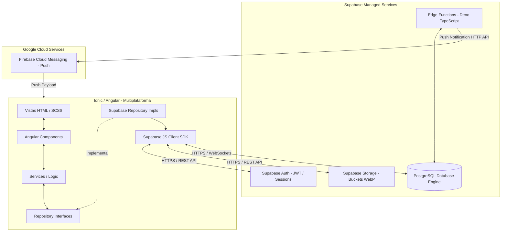
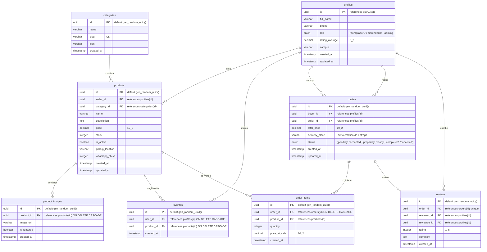
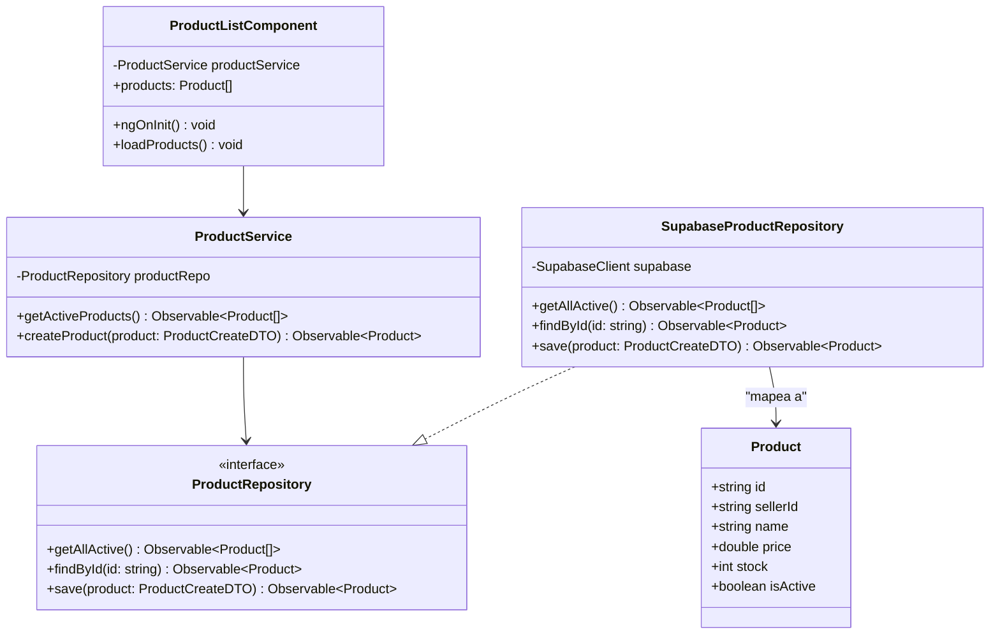
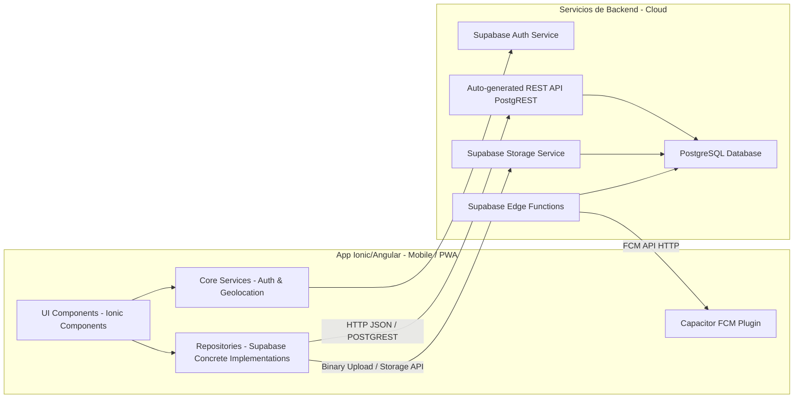
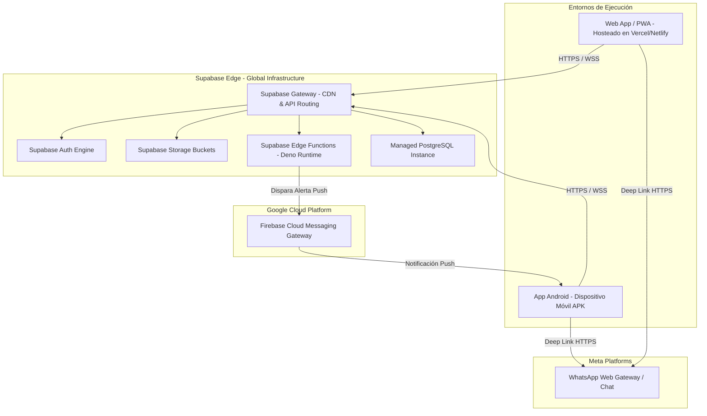

# UCV Market - Master Blueprint
## Documento 02: Arquitectura del Sistema y Modelado UML (Versión Supabase Serverless)

Este documento técnico de arquitectura define la organización estructural, el diseño físico y lógico de la base de datos PostgreSQL, y los diagramas de modelado UML de **UCV Market**, adaptados completamente a la arquitectura serverless provista por **Supabase**.

---

### 11. Arquitectura Completa del Sistema (Serverless)

En esta nueva versión de la arquitectura, eliminamos por completo la capa de servidor tradicional (Laravel + MySQL) y adoptamos un patrón **Client-to-Database Direct (Serverless)**, donde el cliente híbrido de Ionic/Angular se comunica de forma directa y segura con los servicios gestionados de Supabase a través de su SDK oficial.



#### Justificación de las Decisiones Arquitectónicas:
1. **Frontend Desacoplado mediante Repository Pattern:**
   - *Decisión:* Las páginas y componentes de Angular no invocan directamente al SDK de Supabase (`supabase.from('products').select(...)`). En su lugar, consumen interfaces como `ProductRepository` inyectadas mediante Dependency Injection (DI) de Angular.
   - *Alternativa:* Consumo directo del cliente Supabase en los controladores de la vista.
   - *Justificación:* El consumo directo acopla el frontend a la tecnología de Supabase. Si mañana se requiere migrar a Firebase o consumir un API REST clásico, habría que reescribir cada componente. Con el patrón Repository, solo se escribe una nueva implementación concreta de la interfaz (`HttpProductRepository` o `FirebaseProductRepository`) y se registra en el inyector de Angular, sin alterar la UI.

2. **Seguridad en la Base de Datos (Row Level Security - RLS):**
   - *Decisión:* Toda la seguridad y el control de accesos se delegan al motor de base de datos PostgreSQL a través de políticas RLS. El cliente móvil se conecta con una llave pública anónima (`anon_key`), y PostgreSQL valida la identidad del usuario a través del token JWT enviado automáticamente en las cabeceras HTTP por el SDK.
   - *Justificación:* Al no haber un servidor intermedio que valide las peticiones, la base de datos debe ser auto-protegida. RLS permite definir reglas como: *"Un usuario solo puede insertar un producto si su id autenticado (`auth.uid()`) coincide con el campo `user_id` de la fila"*.

---

### 12. Diseño de Base de Datos (PostgreSQL en Supabase)

#### Decisiones Técnicas sobre Datos:
- **UUID como Identificador Clave:** En PostgreSQL, el tipo `UUID` es un ciudadano de primera clase. Utilizaremos UUIDs autogenerados mediante `gen_random_uuid()` para todas las llaves primarias. Esto previene la enumeración de recursos desde el cliente y asegura identificadores únicos globales, vital para una arquitectura distribuida y offline-first.
- **Relación con Supabase Auth (`auth.users`):** Supabase gestiona la tabla interna `users` en el esquema de sistema `auth`. Para resguardar la integridad referencial y almacenar datos complementarios (como el celular de WhatsApp o reputación), crearemos una tabla `profiles` en el esquema `public` con una llave foránea que referencia a `auth.users` con borrado en cascada.

---

### 13. Modelo Entidad-Relación (MER Físico - PostgreSQL)

A continuación se presenta la estructura física detallada de la base de datos relacional en PostgreSQL:



---

### 14. Casos de Uso UML (Detalle del MVP)

El modelado de casos de uso se enfoca estrictamente en las interacciones transaccionales directas del MVP con los servicios de Supabase.

```mermaid
usecaseDiagram
    actor Comprador as "Comprador UCV"
    actor Emprendedor as "Emprendedor UCV"
    actor Administrador as "Administrador UCV"

    package Supabase_Edge_Boundary {
        usecase UC1 as "Registrar Perfil (Supabase Auth)"
        usecase UC2 as "Ver Catálogo y Favoritos (PostgreSQL)"
        usecase UC3 as "Cargar Fotos de Productos (Supabase Storage)"
        usecase UC4 as "Procesar Compra (PostgreSQL Transaction/RPC)"
        usecase UC5 as "Modificar Estados del Pedido"
        usecase UC6 as "Registrar Calificación de Compra"
        usecase UC7 as "Moderar Contenido y Categorías"
        usecase UC8 as "Redirección a WhatsApp"
    }

    Comprador --> UC1
    Comprador --> UC2
    Comprador --> UC4
    Comprador --> UC6
    Comprador --> UC8

    Emprendedor --> UC1
    Emprendedor --> UC3
    Emprendedor --> UC5
    Emprendedor --> UC8

    Administrador --> UC1
    Administrador --> UC7
```

---

### 15. Diagrama de Clases (Frontend Clean Architecture)

Este diagrama ilustra la estructura estática del frontend en Angular, mostrando cómo se desacopla la UI de la base de datos de Supabase utilizando interfaces y el patrón Repository.



---

### 16. Diagrama de Componentes

Muestra la interacción física de los componentes empaquetados dentro de la aplicación híbrida y cómo consumen los módulos en la nube de Supabase.



---

### 17. Diagrama de Despliegue (Infraestructura Serverless)

El despliegue bajo el paradigma serverless simplifica drásticamente la infraestructura. No existen servidores web propios, proxies inversos (Nginx), contenedores de Docker en producción o bases de datos autogestionadas. Todo se despliega en plataformas PaaS/SaaS globales.



#### Explicación de la Infraestructura de Despliegue:
1. **Vercel / Netlify / Supabase Hosting:** El bundle de la aplicación web y PWA compilado por Ionic/Angular se aloja en un hosting de archivos estáticos global (CDN). Esto reduce el coste de infraestructura web a prácticamente $0 USD durante las fases iniciales de la startup y garantiza tiempos de carga extremadamente bajos.
2. **Supabase Gateway:** Actúa como el único punto de entrada a las bases de datos de Supabase. Distribuye y balancea las peticiones de las aplicaciones clientes directamente hacia la base de datos PostgreSQL a través de PostgREST, garantizando seguridad y eficiencia sin necesidad de implementar balanceadores de carga físicos.
3. **Supabase Edge Functions:** Son funciones en la nube ligeras que se ejecutan en un entorno de Deno en servidores Edge (cercanos al usuario). Se utilizarán exclusivamente para interactuar con Firebase Cloud Messaging (FCM) y enviar notificaciones de manera segura, aislando las credenciales privadas de Firebase del código cliente de la app móvil.
